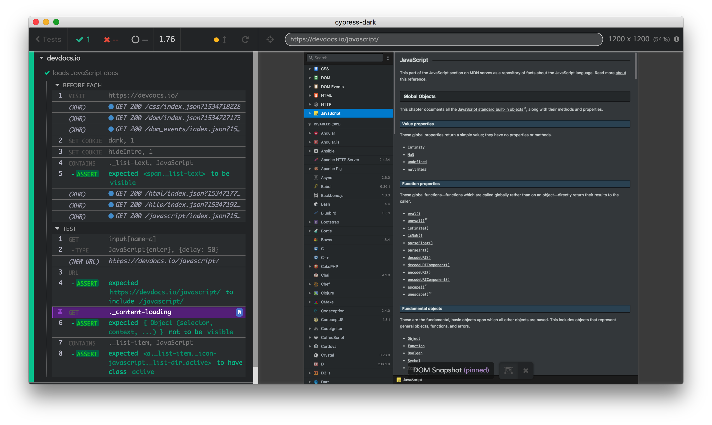
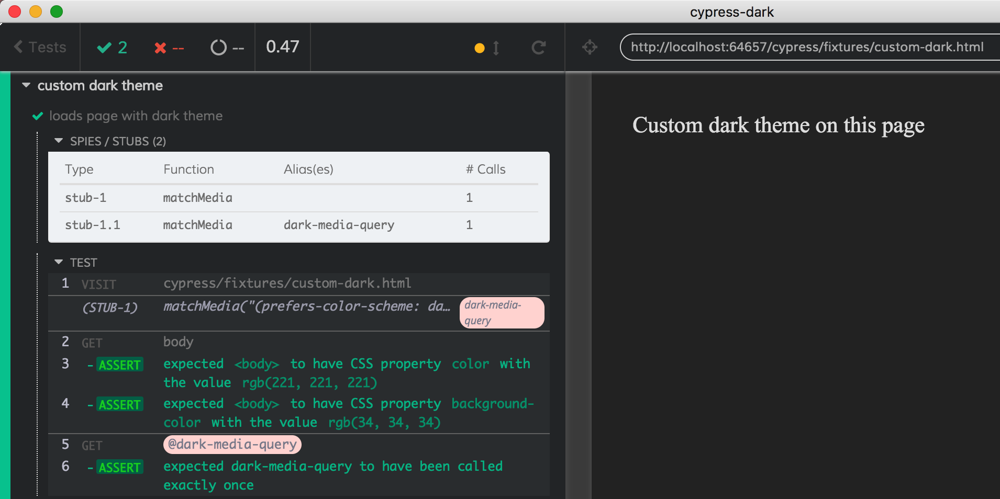

# cypress-dark ![ci status][ci-image]  [](https://dashboard.cypress.io/projects/ipnbuo/runs)

> Dark mode for Cypress test runner from user space

[![NPM][npm-icon]][npm-url]

[![semantic-release][semantic-image]][semantic-url]
[![standard][standard-image]][standard-url]
[![renovate-app badge][renovate-badge]][renovate-app]



You can find videos from Cypress Dark test run on [Cypress Dashboard](https://dashboard.cypress.io/#/projects/ipnbuo/runs)

You can see this theme in action, including playing audio clips on failed test in this [video from ReactiveConf](https://www.youtube.com/watch?v=swpz0H0u13k) around minute 22.

## Install

Requires [Node](https://nodejs.org/en/) version 6 or above.

```sh
npm install --save-dev cypress-dark
```

## Use

### Install Halloween theme

Add to your [cypress/support/index.js](cypress/support/index.js) line

```js
require('cypress-dark/src/halloween')
```

### Install Dark theme

Add to your [cypress/support/index.js](cypress/support/index.js) line

```js
require('cypress-dark')
```

By default dark theme will be loaded. If you want to switch to another theme, set its name in your [cypress.json](cypress.json) file.

```json
{
  "theme": "dark"
}
```

If the theme name is unknown (look at CSS files in [src](src) folder), or unspecified, default `dark` theme will be used.

## Themes

For now all themes are shipped with this package and can use CSS variables. Available themes are:

- [dark](src/dark.css) see [images/dark.png](images/dark.png)
- [halloween](src/halloween.css) see [images/halloween.png](images/halloween.png), also check out how it plays witch's laughter if a test fails in [src/halloween.js](src/halloween.js)

## Dark page under test

You can "tell" the web application under test to switch to the dark mode using `media (prefers-color-scheme: dark)` if the application uses JavaScript media query to check for preferred scheme. See original issue [#29](https://github.com/bahmutov/cypress-dark/issues/29) and [cypress/fixtures/custom-dark.html](cypress/fixtures/custom-dark.html) page.

To enable stubbing `window.matchMedia` from your tests and "force" your app to switch to dark mode, set option in `cypress.json`

```json
{
  "darkMediaQuery": true
}
```

Result - both the test runner and the application are running in dark mode.



### Small print

Author: Gleb Bahmutov &lt;gleb.bahmutov@gmail.com&gt; &copy; 2018

- [@bahmutov](https://twitter.com/bahmutov)
- [glebbahmutov.com](https://glebbahmutov.com)
- [blog](https://glebbahmutov.com/blog)
- [videos](https://www.youtube.com/glebbahmutov)
- [presentations](https://slides.com/bahmutov)
- [cypress.tips](https://cypress.tips)

"Maniacal Witches Laugh Sound" by [Mike Koenig](http://soundbible.com/1129-Maniacal-Witches-Laugh.html), under license Attribution 3.0

License: MIT - do anything with the code, but don't blame me if it does not work.

Support: if you find any problems with this module, email / tweet /
[open issue](https://github.com/bahmutov/cypress-dark/issues) on Github

## MIT License

Copyright (c) 2018 Gleb Bahmutov &lt;gleb.bahmutov@gmail.com&gt;

Permission is hereby granted, free of charge, to any person
obtaining a copy of this software and associated documentation
files (the "Software"), to deal in the Software without
restriction, including without limitation the rights to use,
copy, modify, merge, publish, distribute, sublicense, and/or sell
copies of the Software, and to permit persons to whom the
Software is furnished to do so, subject to the following
conditions:

The above copyright notice and this permission notice shall be
included in all copies or substantial portions of the Software.

THE SOFTWARE IS PROVIDED "AS IS", WITHOUT WARRANTY OF ANY KIND,
EXPRESS OR IMPLIED, INCLUDING BUT NOT LIMITED TO THE WARRANTIES
OF MERCHANTABILITY, FITNESS FOR A PARTICULAR PURPOSE AND
NONINFRINGEMENT. IN NO EVENT SHALL THE AUTHORS OR COPYRIGHT
HOLDERS BE LIABLE FOR ANY CLAIM, DAMAGES OR OTHER LIABILITY,
WHETHER IN AN ACTION OF CONTRACT, TORT OR OTHERWISE, ARISING
FROM, OUT OF OR IN CONNECTION WITH THE SOFTWARE OR THE USE OR
OTHER DEALINGS IN THE SOFTWARE.

[npm-icon]: https://nodei.co/npm/cypress-dark.svg?downloads=true
[npm-url]: https://npmjs.org/package/cypress-dark
[ci-image]: https://github.com/bahmutov/cypress-dark/workflows/ci/badge.svg?branch=master
[ci-url]: https://github.com/bahmutov/cypress-dark/actions
[semantic-image]: https://img.shields.io/badge/%20%20%F0%9F%93%A6%F0%9F%9A%80-semantic--release-e10079.svg
[semantic-url]: https://github.com/semantic-release/semantic-release
[standard-image]: https://img.shields.io/badge/code%20style-standard-brightgreen.svg
[standard-url]: http://standardjs.com/
[renovate-badge]: https://img.shields.io/badge/renovate-app-blue.svg
[renovate-app]: https://renovateapp.com/
